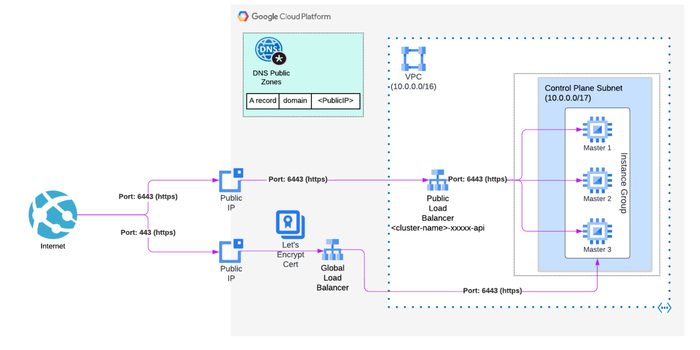

# OSD in GCP API Proxy

Repository for use a LB proxy for OSD in GCP and expose the API using port 443 instead 6443.



## Requirements

* Install Google Auth Python3 lib:

```bash
pip3 install --user google-auth
```

* Generate the certificate with the Let’s Encrypt certification authority (CA), this can be done for example with [certbot](https://letsencrypt.org/docs/client-options/), but can be used any ACME client implementations:

```bash
certbot certonly --manual -d <domain> --preferred-challenges dns --preferred-chain 'ISRG Root X1'
```

* Install OSD in GCP cluster following the [official documentation](https://docs.openshift.com/dedicated/osd_install_access_delete_cluster/creating-a-gcp-cluster.html).

## Usage

* Execute the Ansible Playbooks for deploy all the GCP infrastructure requirements:

```bash
ansible-playbook osd-api-proxy.yml -vv
```

* You need to create a DNS record of type A with the global static IP address generated, pointing to your custom domain that matches to the SSL Certificate generated.

## Access to the OSD cluster using 443 port

* Access to the OSD cluster through the Load Balancer acting as a proxy and using the 443 port:

```bash
oc login --token=<token> --server=https://<domain>:443
```